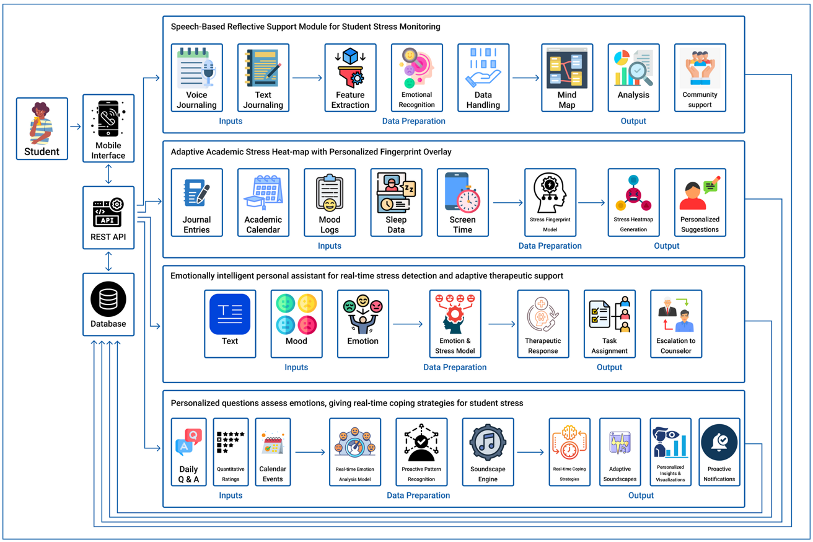

# Mindplus
## A Self-Monitoring and Anonymous Counselling Based Digital Companion for Acedemic Stress Management

### System Overview
This mobile application addresses several shortcomings of existing solutions through interconnected components:​<br>
* Adaptive Academic Stress Heatmap with Personalized Fingerprint Overlay<br>
* Emotionally Intelligent Personal Assistant​<br>
* Speech-based Reflective Support Module​<br>
* Personalized Emotional Assessment and Real-time Coping Support

### System Diagram


## Installation

### Backend
```
cd ml-backend
python -m venv venv
venv\Scripts\activate
pip install fastapi uvicorn scikit-learn numpy pandas pydantic joblib transformers torch datasets
uvicorn main:app --host 0.0.0.0 --port 8000 --reload
```

### Frontend
```
cd mindplus
npm i
npm start
```
